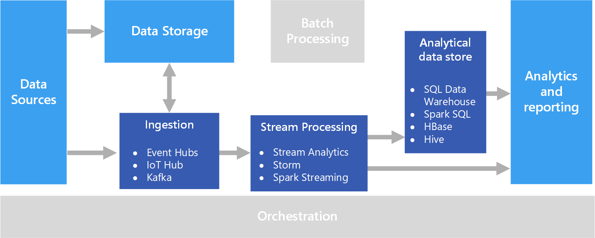

# On_demand_mock_for_databases

In this video we will see a very useful tool to create a large volume of mock data based on a data model.

GOOD PRACTICES - If we choose to use a data source created with simulated data, it is very important to follow the following recommendations:
1_ Define and report the use of these data sets within the work team
2_ Document the process of creation, use of libraries and publish it internally.
3_ Inform the security teams so that there are no misinterpretations about our data sources as they will have the same data model.

Remember -  In object-oriented programming, mock objects are simulated objects that mimic the behavior of real objects in controlled ways, most often as part of a software testing initiative. A programmer typically creates a mock object to test the behavior of some other object, in much the same way that a car designer uses a crash test dummy to simulate the dynamic behavior of a human in vehicle impacts. The technique is also applicable in generic programming. 




### Typical environment where we need to create a database with fictitious content. 

Within a department for the treatment of large volumes of data, it is normal to find ourselves with the need to carry out a proof of concept, process ETL (Extract, transform and load), saturation test, search for vectors with a database with the same data model as the production model but with data they are not real.


The instructions, although obvious, will be similar to the following:

1. That the data model is exactly the same both in data type and assigned length in the production databases.
2. That they are in the same language,
3. Range of zip codes in case you need it.
4. Same telephone prefixes in case you need it.
5. Geo coordinates within the area contemplated for the analysis.

With these criteria we can see that the objective is basically to have a volume of data according to the requirements, similar to that of production, but that does not represent a risk in case of accidental exposure.

### Documentation 

https://en.wikipedia.org/wiki/Mock_object
https://faker.readthedocs.io/en/stable/locales.html  
https://faker.readthedocs.io/en/stable/providers.html
https://empresas.blogthinkbig.com/python-5-formas-de-cargar-datos-csv-proyectos-machine-learning/


###  Model of data 

count 
name 
address 
color 
phone 
nif 
ssn 
cp 
count_bank 

###  Expected output

Obtain a csv file with 5,000,000 records, similar to the following example:

"2","Nacho Bravo Amor","96375901J","Cuesta Xiomara Pacheco 68 Apt. 43 
Navarra, 44752","cp: 96443","#d3890a","+34 738 20 56 37","896-38-3043","count_bank: ES4556922072448745586291"

### Development

To meet the objective we will use Python as the programming language.
As a library for its creation the so-called Faker

https://github.com/joke2k/faker

```
pip install Faker
```
### Basic example

```
from faker import Faker
fake = Faker()

print(fake.name())
print(fake.address())
print(fake.text())
```
